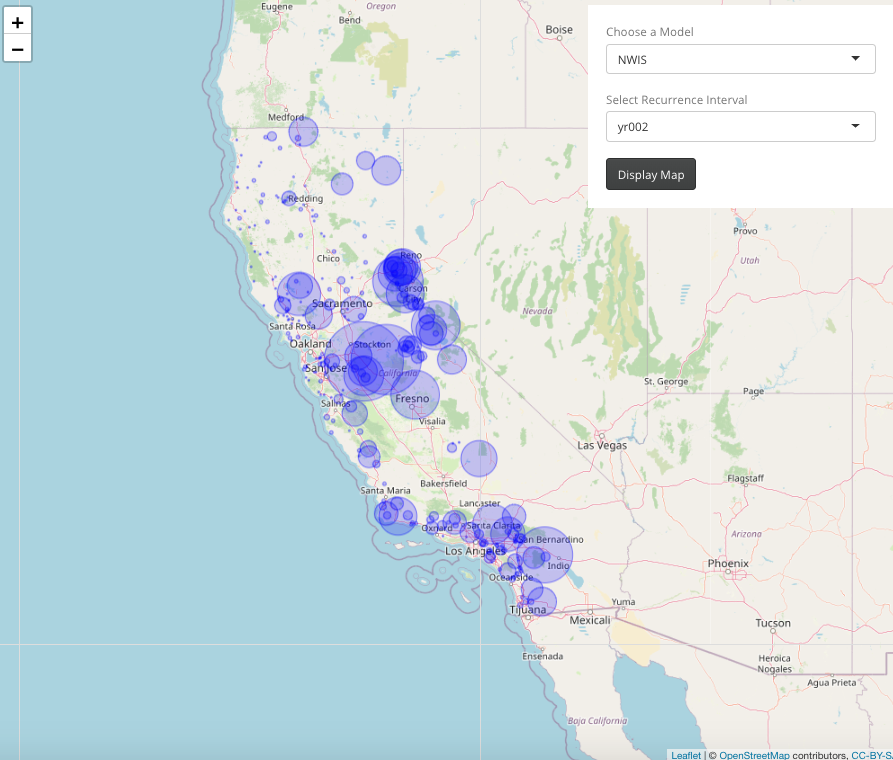

## I: Introduction

All of this work was done under supervision of Mike Johnson, who is a NOAA Affiliate (Water Resource Engineer II) and a PhD candidate in Geography at the University of California, Santa Barbara.  His work can be found [here](https://mikejohnson51.github.io/index.html).  In summary, our main goal was to reanalyze the NOAA National Water Model (NWM) by comparing it to USGS streamflow gage data.  In the end, we hope to be able to see which areas of the United States are becoming wetter/drier and how well the NWM does at predicting these areas of wetness/dryness.

******

## II: Data

In order to begin characterizing hydrologic regions of the United States, our first goal was to create a dataset in which each specific streamflow gage site reports the recurrence interval for three different model types: NWIS, NWM, and the norm of the two.  It was my job to build functions in R through data manipulation that would report the recurrence intervals in addition to the count of exceedances in order to see which sites were more prone to flooding.  I planned to have each model (NWIS, NWM, norm) in the dataframe to be split into 9 different types which correspond to each recurrence interval giving me a total of 27 observations for each site.  The intervals that we decided upon were 1.5 (labeled yrBF), 2, 5, 10, 25, 50, 100, 250, and 500 year intervals.  In summary, the 100-year flood interval can be determined as a flood that statistically has a 1-percent chance of occurring in any given year while a 2 year recurrence interval has a 50-percent chance in any given year.  Further information about flood intervals can be found [here](https://www.usgs.gov/special-topic/water-science-school/science/100-year-flood?qt-science_center_objects=0#qt-science_center_objects).

In order to create this dataset, we first had to separately pull data from the daily observations for both the National Water Model and USGS streamflow gages.  We then merged the two, omitting any NA values.  I then removed all sites that had less than 3650 observations due to the fact that we wanted a large sample size which would be at least 10 years worth of data in this case.  From there I was able to build a function that calculates and returns the peak values for each recurrence interval for each model as well as the norm.  

Recurrence Interval Function:
```{r}
# recurrence_int = function(site) {
#   
#   final = final_df(site)
#   df1 = data.frame(final)
#   if(is.null(df1[1,1])){
#     return(NULL)
#   } else {
#     l = build_l(site)
#     df2 = data.frame(l)
#     if(is.null(df2[1,1])){
#       return(NULL)
#     } else {
#       df = data.frame()
#       
#       nwis_int = l[[1]]
#       nwm_int = l[[2]]
#       change_int = 100 * ((l[[1]] - l[[2]] ) / l[[1]])
#       
#       df = df %>% 
#         rbind(df, nwis_int) %>% 
#         rbind(df, nwm_int) %>% 
#         rbind(df, change_int) 
#       
#       colnames(df) = c(
#         "yr001",
#         "yr002",
#         "yr005",
#         "yr010",
#         "yr025",
#         "yr050",
#         "yr100",
#         "yr250",
#         "yr500"
#       )
#       
#       df = cbind(Model = c("NWIS", "NWM", "Norm"), df)
#       df$COMID = mapping$feature_id[site]
#       df$NWIS_ID = mapping$site_no[site]
#       
#       df = df[, c(11,12,1,2,3,4,5,6,7,8,9,10)]
#       
#             df = df %>% 
#         tidyr::pivot_longer(
#           cols = starts_with("yr"),
#           names_to = "Type",
#           values_to = "Value")
#       
#             return(df)
#     }
#   }
# }
```

Here is an example of an output when running a single site through the function:
```{r, echo=F, warning=F, message=F}
library(readr)
example <- read_csv("example.csv")

DT::datatable(example)
```

After that, I wanted to build another function that was able to return the total number of times per year that the model reports a value that exceeds the value for the recurrence interval.  This "exceedance" dataframe contains 18 columns, one for each model and type, with the rows being specific to each year. Below displays the function for exceedance counts as well as an example of an output from a single site.

Exceedance Function:
```{r}
# exceedance = function(site){
#   
#   final = final_df(site)
#   df = data.frame(final)
#   if(is.null(df[1,1])){
#     return(NULL)
#   } else{
#     l = build_l(site)
#     df1 = data.frame(l)
#     if(is.null(df1[1,1])){
#       return(NULL)
#     } else{
#       dfnew = final %>% 
#         na.omit() %>% 
#         select(date, nwm_cms) %>% 
#         group_by(year = lubridate::year(date)) %>% 
#         summarize(nwmBF = sum(nwm_cms >= l[[2]][1]),
#                   nwm2 = sum(nwm_cms >= l[[2]][2]),
#                   nwm5 = sum(nwm_cms >= l[[2]][3]),
#                   nwm10 = sum(nwm_cms >= l[[2]][4]),
#                   nwm25 = sum(nwm_cms >= l[[2]][5]),
#                   nwm50 = sum(nwm_cms >= l[[2]][6]),
#                   nwm100 = sum(nwm_cms >= l[[2]][7]),
#                   nwm250 = sum(nwm_cms >= l[[2]][8]),
#                   nwm500 = sum(nwm_cms >= l[[2]][9]))
#       
#       dfnew1 = final %>% 
#         na.omit() %>% 
#         select(date, nwis_cms) %>% 
#         group_by(year = lubridate::year(date)) %>% 
#         summarise(nwisBF = sum(nwis_cms >= l[[1]][1]),
#                   nwis2 = sum(nwis_cms >= l[[1]][2]),
#                   nwis5 = sum(nwis_cms >= l[[1]][3]),
#                   nwis10 = sum(nwis_cms >= l[[1]][4]),
#                   nwis25 = sum(nwis_cms >= l[[1]][5]),
#                   nwis50 = sum(nwis_cms >= l[[1]][6]),
#                   nwis100 = sum(nwis_cms >= l[[1]][7]),
#                   nwis250 = sum(nwis_cms >= l[[1]][8]),
#                   nwis500 = sum(nwis_cms >= l[[1]][9]))
#       
#       dfnew = merge(x = dfnew, y = dfnew1, by = "year", all.x = TRUE)
#       
#       dfnew[is.na(dfnew)] = 0
#       
#       return(dfnew)
#     }
#   }
# }
```

Example:
```{r, echo=F, warning=F, message=F}
exceed <- read_csv("exceed.csv")

knitr::kable(exceed)
```

Putting it all together into a final dataframe, I used the exceedance function in order to add two additional columns onto the recurrence function output, which are labeled exceed1 and exceed2.  Exceed1 referes to the total number of exceedances from any year prior to 2006 while exceed2 is the total number of exceedances from 2006 and on.  As reference, I added a colymn for the total number of daily observations for each NWIS and NWM model for each site.  Lastly, I added two more reference columns that display the minimum year for the daily observations as well as the maximum year so that the user has a better idea of how many years/daily observations are being accounted for in exceed1 vs exceed2.

Here is an example of what the final dataframe looks like for one site:
```{r, echo=F, warning=F, message=F}
recurrence <- read_csv("recurrence.csv")

DT::datatable(recurrence)
```

It should be noted that there are no values for exceedance, total count of observations, minimum year, or maximum year for the norm models of each site.  Lastly, I ran a for loop over all 7541 USGS sites and row binded the resulting dataframes.  As a result, I produced a dataframe containing 169,776 observations with 10 columns.

******

## III: Visualization

I wanted to being creating visualizations of the data in order to get a better feel of which areas are experiencing higher exceedance counts than others within the United States.  In order to do this, I started to utilize data science tools that I have recently learned such as Tableau and RShiny in order to create interactive plots of the data.  However, if I were to publish these plots, the data source would also be public which is something that cannot be done at the time.  In the meantime, here are screenshots from a Tableau and an RShiny interactive plot of solely sites located in California.

<center>

</center>

This Tableau visualization above displays sites within California, filtered on the NWIS model as well as type yrBF which is the 1.5 year recurrence interval.  Furthermore, the sites markers are sized and colored based on the number of exceedances from 1993-2005.  However, not much can be taken from this image as the number of observations vary from site to site for exceed1.

<center>

</center>

This next image is similar to the first but different in that I wanted to test my coding abilities and write this web application using RShiny.  Once again, it displays the sites in California with the markers sized based on the number of exceedances in exceed1.  However, this time the sites were filtered to the NWIS model and the 2 year recurrence interval.  Once again, we cannot learn much from this viz due to the fact that sites with more observations will naturally have a higher exceedance count.

******

Hopefully, we will continue to make progress with this research as it will be important to see the accuracy of the National Water Model as well as which areas of the country are becoming wetter or drier over time.